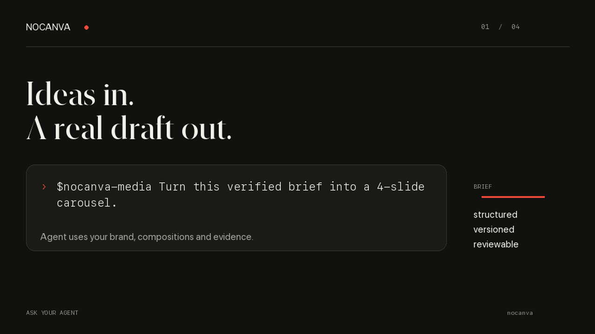

# NoCanva

**The shared media desk for humans and agents.**

Your agent drafts. You review in the browser. NoCanva keeps every revision and exports the exact PNG you approved.

No embedded LLM. No mystery rerender. No design-by-coordinate prompts.



## Hosted beta

Visit [NoCanva](https://nocanva-app.sidsaini1196.workers.dev), then open your workspace and continue with Google. Every user gets a personal workspace.

### Codex

```bash
codex mcp add nocanva --url https://nocanva-mcp.sidsaini1196.workers.dev/mcp
codex mcp login nocanva
```

Then install the workflow skill in Codex:

```text
$skill-installer https://github.com/nocanva/nocanva/tree/main/skills/nocanva-media
```

### Claude Code

```bash
claude mcp add --transport http nocanva https://nocanva-mcp.sidsaini1196.workers.dev/mcp
claude mcp login nocanva
```

Install the workflow skill for Claude Code:

```bash
mkdir -p ~/.claude/skills/nocanva-media
curl -fsSL https://raw.githubusercontent.com/nocanva/nocanva/main/skills/nocanva-media/SKILL.md \
  -o ~/.claude/skills/nocanva-media/SKILL.md
```

Your browser opens once. Sign in with Google and approve the requested NoCanva scopes. The client is then connected to the same personal workspace you see in the UI.

Try:

```text
Turn this verified brief into a four-slide carousel with NoCanva.
Show me every rendered draft before asking for approval.
```

Full client setup and troubleshooting: [MCP clients](./docs/MCP_CLIENTS.md)

## Use the UI

- Open the hosted workspace at [`/create`](https://nocanva-app.sidsaini1196.workers.dev/create).
- Open agent-created drafts and carousels from their stable workspace URLs.
- Review the real rendered PNG, not a text approximation.
- Edit copy, choose media, and adjust crop or focal point.
- Approve one exact revision. Hosted approval is human-only.
- Download the immutable PNG or carousel ZIP.
- Create a revocable bearer token under **Connect** only for CI or headless agents.

## Self-host

Requires Docker and Node.js 22.18 or newer.

```bash
git clone https://github.com/nocanva/nocanva.git
cd nocanva
npm install
npm run self-host
```

Open `http://localhost:3000`. Full setup: [Self-hosting](./docs/SELF_HOSTING.md)

## Develop

```bash
npm install
npm run dev                 # UI: http://localhost:3000
npm run connect -- codex    # local stdio MCP
```

Before opening a pull request:

```bash
npm test
npm run lint
npx tsc --noEmit
npm run mcp:fixture
npm run mcp:draft-fixture
npm run mcp:carousel-fixture
```

## Product contract

- Agents supply verified copy and creative judgment.
- NoCanva owns constrained brands, compositions, revisions, checks, approvals, and rendering.
- Every edit is revisioned; stale writes fail.
- Approval pins a reviewed revision and its PNG hash.
- Final rendering promotes those exact reviewed bytes.
- Templates and brand rules are versioned.

The daily MCP API uses `nocanva_*`. The older `canvnah_*` namespace remains only for advanced brand/template administration and compatibility.

## Documentation

- [MCP clients](./docs/MCP_CLIENTS.md)
- [Media workflow skill](./skills/nocanva-media/SKILL.md)
- [Layout-authoring skill](./skills/nocanva-layout/SKILL.md)
- [What is NoCanva?](./docs/WHAT_IS_NOCANVA.md)
- [Self-hosting](./docs/SELF_HOSTING.md)
- [Cloud deployment](./docs/CLOUD_DEPLOYMENT.md)
- [Operations](./docs/OPERATIONS.md)
- [Public beta checklist](./docs/BETA_RELEASE.md)
- [Contributing](./CONTRIBUTING.md)
- [Security](./SECURITY.md)

MIT licensed.
